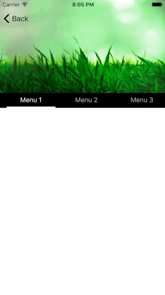

# HeaderedTabScrollView

## Description

A custom viewController managing a header + a tab-based view. 

There are two versions available: one using an [ACTabScrollView](https://github.com/azurechen/ACTabScrollView) as the tab-based view and the other using a [PageMenu](https://github.com/PageMenu/PageMenu/)


I needed that for a project and though it could be useful to other people too since I struggled a bit to make it work right.

The main idea of how this works is inspired by this [stackoverflow question](https://stackoverflow.com/questions/25374090/move-a-view-when-scrolling-in-uitableview).


## Installation

### Pod
Depending on which version (ACTabScrollView or PageMenu) you want to use, add one of the following line to your Podfile: 

`pod 'HeaderedTabScrollView/ACTabScrollView', :git => 'https://github.com/tsucres/HeaderedTabScrollView.git'`

or

`pod 'HeaderedTabScrollView/PageMenu', :git => 'https://github.com/tsucres/HeaderedTabScrollView.git'`

If you don't specify a subspec, the two versions will be installed.

Don't forget to `import HeaderedTabScrollView` wherever you need it.

**Note**: The [last pod release](https://github.com/PageMenu/PageMenu/releases/tag/2.0.0) of PageMenu isn't [the last version available](https://github.com/PageMenu/PageMenu/compare/2.0.0...master) on the github repo and doesn't include a [fix](https://github.com/PageMenu/PageMenu/commit/a6279a0070d79e5d28e8f1e4288ba4cef504402b) for a bug on the first subpage. If you experience this bug, you'll have to change the `CAPSPageMenu+UIConfiguration.swift` file to match [the fix](https://github.com/PageMenu/PageMenu/commit/a6279a0070d79e5d28e8f1e4288ba4cef504402b).

I know it's a bit crappy to do so but it's the easiest solution I can think of :/

### Manually

You'll need: 

- the `AbstractHeaderedTabScrollViewController.swift` file
- according to the version you want, either `HeaderedCAPSPageMenuViewController.swift` or `HeaderedACTabScrollViewController.swift` (or both)
- All the files needed by ACTabScrollView and/or PageMenu (those start respectively by `ACT` and `CAPS`)


Just copy those files in your project and you should be ready to go :)

## Basic Usage

You can use two classes to do the same thing, depending on whether you want to use a [ACTabScrollView](https://github.com/azurechen/ACTabScrollView) or a [PageMenu](https://github.com/PageMenu/PageMenu).


#### \w ACTabScrollView

First of all you have to subclass a `HeaderedACTabScrollViewController`. 

To complete the configuration, you have to set the header view and to configure the ACTabScrollView. The later is accessible throug the property `tabScrollView`.

The whole thing should look to something like this: 

```swift

class BasicHeaderedACTabScrollViewController: HeaderedACTabScrollViewController, ACTabScrollViewDelegate,  ACTabScrollViewDataSource {
	
	// ACTabScrollView content
	var subPageViews: [UIView] = []
	var subPageTitles = ["One", "Two", "Three"]
    
	override func viewDidLoad() {
		super.viewDidLoad()
		
		// 1) Header init
		self.headerView = // Your custom UIView
		self.headerHeight = // ...
		
		// 2) ACTabScrollView initialisation
		for _ in 0 ..< subPageTitles.count {
        	let subPageVC = SubPageViewController() // your controller
        	subPageVC.// do want you want
        	
			addChildViewController(subPageVC)
			subPageViews.append(subPageVC.view)
        	
			// TODO: link subPageVC.scrollviewDidScroll to self.pleaseScroll (see below)
        }
        
        // ACTabScrollView delegate & dataSource (optionnal)
        self.tabScrollView.dataSource = self
        self.tabScrollView.delegate = self
		
	}
}
```


Finally, you have to call the method `pleaseScroll()` each time a subpage is scrolled. The easiest way to do it, is to override the `scrollViewDidScroll` method in each subpage to make it call the `pleaseScroll` method. In your subpage controller you would have something like: 

```swift

class SubPageController: UIViewController, UIScrollViewDelegate {
	weak var parentHeaderedTabScrollViewController: AbstractHeaderedTabScrollViewController?
	func scrollViewDidScroll(_ scrollView: UIScrollView) {
		self.parentHeaderedTabScrollViewController?.pleaseScroll(scrollView)
	}
}

class BasicHeaderedACTabScrollViewController: HeaderedACTabScrollViewController, ACTabScrollViewDelegate,  ACTabScrollViewDataSource {
	// ...
	override func viewDidLoad() {
		// ...
		// For each subpageController: 
		vc.parentHeaderedTabScrollViewController = self
		// ...
	}
	// ...
}
```

Another solution, instead of passing a reference to the `HeaderedTabScrollViewController` to the `SubPageController`, is to just pass the `pleaseScroll` method: 

```swift
class SubPageController: UIViewController, UIScrollViewDelegate {
	var scrollDelegateFunc: ((UIScrollView)->Void)?
	func scrollViewDidScroll(_ scrollView: UIScrollView) {
		self.parentHeaderedTabScrollViewController?.pleaseScroll(scrollView)
	}
}

class BasicHeaderedACTabScrollViewController: HeaderedACTabScrollViewController, ACTabScrollViewDelegate,  ACTabScrollViewDataSource {
	// ...
	override func viewDidLoad() {
		// ...
		// For each subpageController: 
		vc.scrollDelegateFunc = { [weak self] in self?.pleaseScroll($0) }
		// ...
	}
	// ...
}
```

For more details and a concrete example, check the [`BasicHeaderedACTabScrollViewController.swift`](Example/HeaderedTabScrollView/BasicHeaderedACTabScrollViewController.swift) file.

#### \w CAPSPageMenu

The process is basically the same than for an ACTabScrollView based controller. The main difference is that you have to to subclass a `HeaderedCAPSPageMenuViewController`.

As in the previous case, you have to do 2 things to complete the configuration of the controller: set the header view and configure the `CAPSPageMenu`. After initialisation, the later is accessible through the `pageMenuController` property.

```swift
class BasicHeaderedCAPSPageMenuViewController: HeaderedCAPSPageMenuViewController, CAPSPageMenuDelegate {
    
	// PageMenu content: init your controllers the way you want.
	var subPageControllers: [UIViewController] = []
	var subPageTitles = ["One", "Two", "Three"]
    
	override func viewDidLoad() {
		super.viewDidLoad()
       
		// 1) Header init
		self.headerView = // Your custom UIView
		self.headerHeight = // ...
		
		s
		// 2) PageMenu initialisation
		for _ in 0 ..< subPageTitles.count {
        	let subPageVC = SubPageViewController() // your controller
        	subPageVC.// do want you want
        	
			addChildViewController(subPageVC)
			subPageControllers.append(subPageVC)
        	
			// TODO: link subPageVC.scrollviewDidScroll to self.pleaseScroll
        }
        
        let parameters: [CAPSPageMenuOption] = [
            // see PageMenu doc
        ]
        self.addPageMenu(menu: CAPSPageMenu(viewControllers: subPageControllers, frame: CGRect(x: 0, y: 0, width: pageMenuContainer.frame.width, height: pageMenuContainer.frame.height), pageMenuOptions: parameters))
        
        
        // PageMenu delegate (optionnal)
        self.pageMenuController!.delegate = self
    }
}

```


And finally, don't forget to link the `pleaseScroll` method with the `scrollviewDidScroll` method from all the subpage controllers. (see previous section).
 

For more details and a concrete example, check the [`BasicHeaderedCAPSPageMenuViewController.swift`](Example/HeaderedTabScrollView/BasicHeaderedCAPSPageMenuViewController.swift) file.


 
## Advanced customisation

### TabBar style

Since the ACTabScrollView/PageMenu is accessible through the `tabScrollView`/`pageMenuController` property, you can customise its apparence as you would normally in any other situation. Just check the respective documentations ([ACTabScrollView](https://github.com/azurechen/ACTabScrollView) & [PageMenu](https://github.com/PageMenu/PageMenu/)) for more informations.

### Colors

Some properties have been added to the `AbstractHeaderedTabScrollView` to make the gesture of the colors of the navBar and the header easier.

```swift
public var navBarTransparancy: CGFloat
public var navBarColor: UIColor
public var headerBackgroundColor: UIColor?
public var navBarItemsColor: UIColor
public var navBarTitleColor: UIColor

```

Those properties are particularly useful if you implement custom animations.


### More header animations according to the vertical position

By default, there are 3 effects that are implemented: 

- the alpha of the navigation bar (to make it progressively appear as the tabScrollView is scrolled up);
- the y position of the header (to create a parallax effect);
- the alpha of the header (to make it disappear as the tabScrollView is scrolled up).

Those are called from the `headerDidScroll` method (in `AbstractHeaderedTabScrollView `): 

```swift
public func headerDidScroll(minY: CGFloat, maxY: CGFloat, currentY: CGFloat) {
	updateNavBarAccordingToScrollPosition(minY: minY, maxY: maxY, currentY: tabTopConstraint!.constant)
	updateHeaderPositionAccordingToScrollPosition(minY: minY, maxY: maxY, currentY: tabTopConstraint!.constant)
	updateHeaderAlphaAccordingToScrollPosition(minY: minY, maxY: maxY, currentY: tabTopConstraint!.constant
}
```

If you want to add other effects (that you create) or remove some of them, just override this method.


Check the [`CustomAnimationViewController.swift`](Example/HeaderedTabScrollView/CustomAnimationViewController.swift) (in the `Example` folder) for a concrete example.




## Internal structure of the project

- `HeaderedTabScrollView/Casses` 
	- `AbstractHeaderedTabScrollViewController.swift` : defines the main class of the project. You can't drectly use it though. You have to use one of its subclass.
	- `HeaderedACTabScrollViewController.swift` : defines the subclass using a ACTabScrollView 
	- `HeaderedCAPSPageMenuViewController.swift`: defines the subclass using a PageMenu
- `Example`: 6 examples are implemented
	- `WithoutNavBarExample.swift` : demonstrate the use of a `HeaderedACTabScrollViewController` without navigation bar.
	- `BasicHeaderedACTabScrollViewController` : minimal implementation of a `HeaderedACTabScrollViewController`
	- `BasicHeaderedCAPSPageMenuViewController.swift` : minimal implementation of a `HeaderedCAPSPageMenuViewController`
	- `HNUserPageController.swift` : implementation of a user profile page using a ``
	- `HaDExampleViewController` : another example using an  `HeaderedACTabScrollViewController `

# TODO
- Add an effect (zoom, parallax) on the header when the subpage is pulled down.
- Support horizontal orientation